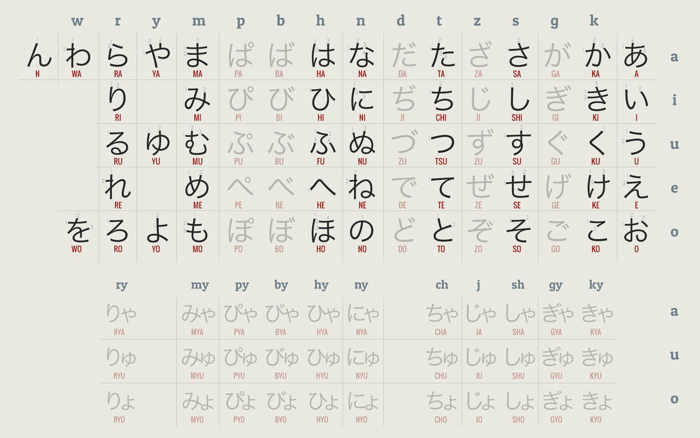

# Aprendiendo japonés con un gordo barbudo #6

## Gramática básica con Cure Dolly

### Lección 5

Hoy nos toca aprender a armar verbos y lo primero que vamos a ver son las formas de los verbos. En ponja, los verbos se agrupan en tres grupos: Ichidan 「一段」, Godan 「五段」 y verbos irregulares 「不規則」.

#### 「一段」

Estos son los fáciles; casi todos terminan en 「る」 y para usarlos solo cambiás 「る」 por lo que necesitás.

```text
たべる
```

```estructura
[Raíz] 「る」
```

La raíz nunca cambia en estos verbos; por eso es fácil cambiarlos de forma.

```text
たべ + ます → たべます
たべ + て → たべて
```

#### 「五段動詞」

Estos son los jodidos, pero por suerte, como vamos a ver, son bastante regulares a pesar de tener cinco variaciones. El 「五」 es porque hay cinco maneras de cambiar dependiendo del verbo auxiliar para cambiar su forma y está atado a las cinco vocales del ponja, cosa que puede verse en cualquier abecedario (mirar en extras); son las columnas principales.

```text
あるく
あるきます
あるいて
あるかない
```

Es fácil notar que, al cambiar la forma del verbo (con verbos auxiliares), se adaptan de manera distinta dependiendo del caso.

#### 「不規則動詞」

Hay pocos verbos irregulares en el ponja y los más comunes son dos.

```text
する
くる
```

Ahora vamos a ver cómo se comportan, pero son un poco raros, especialmente cuando usamos el 「ます」 (cosa que falta un rato para aprender).

##### Extras

A la izquierda tenemos las famosas cinco vocales; ni ganas de marcarlas en el GIMP, así que usen sus ojos.



---

Tags: #japonés #lenguaje
