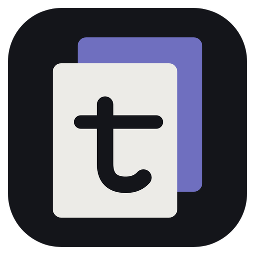

# tModManager - El mod manager de Cyberpunk cambió de nombre

## Preámbulo

En marzo [conté](/blog/18) que había forkeado la Nexus Mods App, discontinuada, para dejarla sólo para Cyberpunk 2077 en Linux. El post terminaba con dos pendientes: sacarme de encima el formato `.nx`, que era una fuente de archivos perdidos, y un botón de endorse.

Siete meses y 167 commits después sale la v0.24.0, y la app se llama **tModManager**. El primer pendiente está hecho. El endorse sigue esperando.

## Por qué el nombre

Porque no va a ser sólo de Cyberpunk. En la lista hay, en este orden: **The Witcher 3** (la remasterizada que salió hace unos días), **Skyrim SE/AE y Fallout 4**, y **KOTOR 1 y 2**, que hoy se modean a mano sí o sí, con `Override/`, TSLPatcher y un orden de instalación que si le errás arrancás de nuevo.

Todavía no hay código de ninguno de esos juegos, y es a propósito. Primero hubo que desacoplar Cyberpunk del núcleo: el código heredado asumía un solo juego en lugares donde nadie lo esperaría, desde el gestor del orden de carga hasta las carpetas de backup. Esa fase ya está. La siguiente son las piezas genéricas que el segundo juego va a necesitar, cada una probada primero con Cyberpunk, que ya tiene un caso real para casi todas.

La otra regla es no atarse a Nexus. Es la fuente más popular, no la única: los mods de KOTOR viven en Deadly Stream, y otros en GitHub.

## Chau `.nx`

La app oficial guardaba todo lo descargado en archivos `.nx`, un formato propio pensado para su modelo premium. Si se perdía uno, el mod quedaba roto y había que volver a bajarlo de Nexus.

Ahora hay dos cosas separadas. Las **descargas originales** quedan tal como vinieron en `tModManager/Downloads`, con el nombre que les pone Nexus. Lo **extraído** va a un store propio, archivo por archivo, direccionado por hash. Si falta algo del store, porque lo borré a mano, porque corrió un Deep Clean o porque limpié espacio, la app lo vuelve a extraer de la descarga. Sólo baja de Nexus si la descarga tampoco está.

Para quien venía de la versión anterior hay un asistente que encuentra los `.nx` viejos y guía la limpieza.

## Borrar sin romper nada

Un mod manager borra cosas todo el tiempo, y en Linux con Proton eso tiene trampas que en Windows no existen. La más linda: un prefix de Wine trae `dosdevices/z:` apuntando a `/`. Un borrado recursivo que sigue symlinks entra por ahí y se lleva el disco entero.

Así que hubo una auditoría de cada borrado de la app:

- **Ningún borrado sigue symlinks.**
- La app **nunca escribe, borra ni indexa fuera del juego** y de sus propias carpetas. Un mod que intenta instalar algo con `..` en la ruta se rechaza al instalar.
- **Deja de compartir carpetas con la app oficial.** Configuración, temporales y base de hashes vivían en las mismas carpetas que los de la oficial: al cerrar, tModManager vaciaba los temporales de la otra, y su limpieza podía borrar una base de hashes que la otra tenía abierta. Ahora cada una tiene lo suyo, y los datos viejos se migran solos.
- **Una lista propia de archivos originales del juego.** Reset, Deep Clean y Apply se apoyan en ella para no tocar nada vanilla. Sale de la base de hashes de Nexus si conoce la versión de Steam, y del disco si no. Después de un parche, el botón **"Actualicé el juego"** la rehace.

Todo eso se probó en la instalación real, que es donde aparecen los bugs. Pero no a pelo: hay un modo en `dev.sh` que saca un snapshot de `/home`, deja todo el disco en sólo lectura salvo la carpeta de la app, el juego y el prefix, y recién ahí abre la app. Si algo intenta escribir donde no debe, falla en vez de romper. Así salió, por ejemplo, que Deep Clean no podía mover carpetas entre subvolúmenes de btrfs.

## Lo demás

**Proton desde la app.** Un panel "Wine prefix" en Mis juegos revisa si al prefix le faltan `d3dcompiler_47` o `vcrun2022`, y un botón los instala con protontricks. El Storage Manager también borra el prefix de Proton entero, para cuando conviene que Steam lo regenere de cero.

**Colecciones más firmes.** Antes de bajar una colección, busca en Descargas lo que ya está: en la última prueba vinculó 252 de 284 mods en menos de una décima de segundo y bajó sólo el resto. Las llamadas que Cloudflare frena ahora se espacian y se reintentan solas. Y la cookie de sesión de Firefox le llega a `curl` por stdin, no como argumento, donde cualquier proceso de la máquina la podía leer con `ps`.

**Cara propia.** Afuera el naranja de Nexus. El tema ahora es grafito e índigo, la paleta de la cueva, y el ícono es de la familia de tWriter: dos capas, el mod encima del juego, y la t.

**Debajo del capó.** .NET 10, dependencias al día (los avisos de vulnerabilidades de NuGet resueltos) y cero warnings del compilador. En el camino se fueron 26 mil líneas y entraron 12 mil.

## Qué queda

Witcher 3, que arranca cuando estén las piezas genéricas que necesita. Y el endorse, que los modders se siguen mereciendo.

## Repo

Está acá: [github.com/T4toh/tModManager](https://github.com/T4toh/tModManager). La AppImage se baja de las [releases](https://github.com/T4toh/tModManager/releases/latest), con su `sha256` al lado. Sigue siendo la que uso para mi propia partida.

---

Tags: #linux #dotnet #cyberpunk #mods
